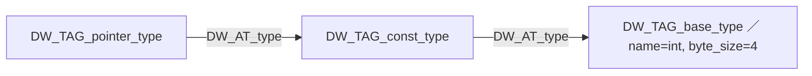

# 型と変数の場所 ―― DWARF が記述する世界

DIE の木という器の中に、DWARF は具体的に何を書き込むのでしょうか。この章では、デバッグでとくに重要な 2 つ ―― **型の表現**と、**変数がどこにあるか**を表す**場所式** (location expression) ―― を詳しく見ます。場所式は DWARF の中でも独特で、小さなスタックマシンのプログラムになっています。ここを理解すると、「デバッガが変数の値を取り出す」という一見魔法のような操作の中身が見えてきます。

## 型を DIE で表す

C の型は、基本型（`int` など）から始まり、ポインタ・配列・構造体・`const` 修飾などを組み合わせて作られます。DWARF は、これらを**型 DIE の組み合わせ**で表現します。各型 DIE は `DW_AT_type` 属性で別の型 DIE を指し、修飾や合成を表します。主な型タグは次のとおりです [](#cite:dwarf2017)。

| タグ | 表す型 |
|---|---|
| `DW_TAG_base_type` | 基本型（`int`, `char`, `double` など） |
| `DW_TAG_pointer_type` | ポインタ型 |
| `DW_TAG_array_type` | 配列型 |
| `DW_TAG_const_type` | `const` 修飾 |
| `DW_TAG_typedef` | 型の別名 |
| `DW_TAG_structure_type` | 構造体 |
| `DW_TAG_member` | 構造体のメンバ |

基本型 DIE は、`DW_AT_byte_size`（バイト数）と `DW_AT_encoding`（符号付き整数・符号なし・浮動小数・文字など、値の解釈方法）を持ちます。たとえば `int` は「byte_size=4, encoding=signed」、`unsigned char` は「byte_size=1, encoding=unsigned_char」です。これで、あるメモリ番地のバイト列を「どう数値に解釈するか」が決まります。

合成型は、型 DIE の鎖で表されます。たとえば `const int *p;` の `p` の型 ―― 「`const int` へのポインタ」 ―― は、次のような鎖になります。



`p` の変数 DIE は、その `DW_AT_type` でこの `pointer_type` を指します。デバッガは鎖をたどって「`p` はポインタ → 指す先は const → その先は int」と型を組み立て直し、`*p` を評価したり、サイズを計算したりできるわけです。

構造体は `DW_TAG_structure_type` で表し、各メンバを `DW_TAG_member` の子 DIE として持ちます。メンバ DIE は `DW_AT_data_member_location`（構造体先頭からのバイトオフセット）を持つので、`s.field` のアドレスは「`s` のアドレス + メンバのオフセット」で求まります。コンパイラがメンバ間に挿入したパディングも、このオフセットから読み取れます。

## 変数の「場所」という難問

型が分かっても、まだ値は読めません。「その変数が**いまどこにあるか**」が要ります。これが場所 (location) の問題です。

素朴には「変数 `x` はアドレス 0x601040 にある」と書けば済みそうですが、現実はそう単純ではありません。

- グローバル変数なら固定アドレスでよい。
- ローカル変数は**スタック上**にあり、関数のスタックフレームを基準とした相対位置で表す必要がある。
- 値は**レジスタ**に置かれているかもしれない（メモリ上に存在しないことすらある）。
- 最適化により、同じ変数が**実行位置によって違う場所**にあることもある（ある区間はレジスタ、別の区間はスタック、など）。

この多様な「場所」を統一的に表すために、DWARF は単なるアドレスではなく、**場所式**という小さなプログラムを使います [](#cite:bendersky2011)。

## 場所式 ―― スタックマシンのプログラム

場所式は、`DW_OP_*` という**オペコード**の並びです。これを、空のスタックを持つ小さな仮想マシンで実行すると、スタックの一番上に「変数の場所（多くはアドレス）」が残る、という仕掛けになっています。変数 DIE の `DW_AT_location` 属性に、この式が入っています。主なオペコードを挙げます。

| オペコード | 動作 |
|---|---|
| `DW_OP_addr <addr>` | 定数アドレスをスタックに積む |
| `DW_OP_fbreg <offset>` | フレーム基準アドレス + offset を積む |
| `DW_OP_reg<n>` | 値はレジスタ n そのものにある（メモリではない） |
| `DW_OP_breg<n> <offset>` | レジスタ n の値 + offset を積む |
| `DW_OP_plus` | スタック上位 2 つを足す |

最も単純なのはグローバル変数です。`DW_OP_addr 0x404040` なら、「その定数アドレスがこの変数の場所」という意味です。デバッガはそのアドレスから、型の `byte_size` 分のバイトを読み、`encoding` に従って数値に直します。

ローカル変数では `DW_OP_fbreg` がよく使われます。これは「**フレームベース** + offset」を計算します。フレームベースとは、その関数のスタックフレームの基準点で、関数 DIE の `DW_AT_frame_base` 属性に（これも場所式で）定義されています。たとえば「フレームベースはレジスタ rbp の指す先」と定義され、変数 `sum` の場所が `DW_OP_fbreg -20` なら、`sum` は「フレームベースから 20 バイト下」にある、と分かります。

> [!IMPORTANT]
> ここに `DW_OP_reg<n>`（`DW_OP_fbreg` などと違い、最後がレジスタ番号）という特別なケースがあります。これは「変数の値が**レジスタそのものに入っており、メモリ上のアドレスを持たない**」ことを表します。最適化で変数がレジスタに割り付けられると、こうなります。このとき変数の `&x`（アドレス）を取ることは原理的にできません ―― メモリに存在しないのですから。デバッガで「最適化された変数のアドレスが取れない」「値はあるのにアドレスがない」という現象は、この `DW_OP_reg` が背景にあります。次章の「分かること・分からないこと」に直結する重要な点です。

## 場所が時間とともに変わる ―― ロケーションリスト

最適化されたコードでは、1 つの変数の場所が**実行アドレスによって変わる**ことがあります。関数の入口ではレジスタ rdi にあった引数が、途中でスタックに退避され、後半では別のレジスタに移る、といった具合です。この「アドレス範囲ごとに違う場所式」を表すのが**ロケーションリスト** (location list) で、`.debug_loclists` セクションに格納されます。

ロケーションリストは、おおむね次のような区間の並びです。

```
[0x1149, 0x1152) ではこの変数は DW_OP_reg5（レジスタ rdi）
[0x1152, 0x1170) ではこの変数は DW_OP_fbreg -20（スタック）
それ以外の範囲では「場所なし」（値は失われている）
```

変数 DIE の `DW_AT_location` が、単一の式ではなくこのリストを指す場合、デバッガは「**いま停止している命令アドレス**」を鍵にして、該当区間の場所式を選びます。だから、同じ変数でも止めた場所によって読めたり読めなかったりするのです。

> [!CAUTION]
> ロケーションリストに「それ以外の範囲では場所なし」という区間があることに注意してください。最適化により、ある区間ではその変数の値がどこにも保持されていない、という状態が普通に起こります。そこで止めて `print x` すると、デバッガは「`<optimized out>`（最適化により消去）」と答えます。値が無いのではなく、その瞬間どこにも保持されていないので答えようがないのです。この挙動の理由は、次章でさらに掘り下げます。

## 行番号情報への橋渡し

ここまでで、「アドレスが分かれば、そこにある変数の名前・型・場所を引ける」ところまで来ました。残るは逆方向、「アドレスから**ソースの行**を引く」仕組みです。`add` 関数が `main.c` の何行目から始まるかは関数 DIE の `DW_AT_decl_line` 属性に書かれていますが、これは「宣言が書かれた行」であって、「実行中のこの命令がどの行か」とは別物です。

実行中の任意のアドレスを行に対応づけるには、もっと細かい、命令アドレス単位の対応表が必要です。それを提供するのが `.debug_line` セクションの**行番号プログラム**で、これは DWARF の中でもとりわけ巧妙な圧縮の工夫が詰まった部分です。次章で詳しく見ていきましょう。
