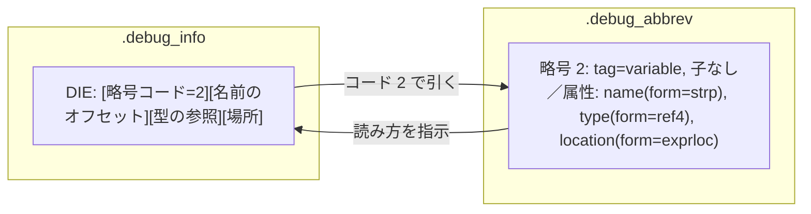

# DIE の符号化 ―― .debug_info と .debug_abbrev

前章で、DWARF は DIE（デバッグ情報エントリ）の木で情報を表す、と述べました。この章では、その木が**バイト列としてどう符号化されるか**を具体的に見ます。DWARF の符号化は、コンパクトさのために少々手の込んだ仕掛けを使っています。その中心が、`.debug_info`（本体）と `.debug_abbrev`（略号表）の二人三脚です。ここを理解すると、`.debug_info` の生バイトを `readelf` のツリー表示に翻訳できるようになります。

## コンパイル単位ヘッダ

`.debug_info` は、**コンパイル単位** (compilation unit, CU) の集まりです。1 つの CU は、おおむね 1 つのソースファイル（とそれが `#include` したもの）に対応します。各 CU は、ヘッダから始まります。DWARF 第 5 版の CU ヘッダは次のとおりです [DWARF, 2017](#cite:dwarf2017)。

```c
struct {
    uint32_t unit_length;    /* この CU の残りのバイト数 */
    uint16_t version;        /* DWARF バージョン（5） */
    uint8_t  unit_type;      /* 単位の種類（DW_UT_compile など） */
    uint8_t  address_size;   /* アドレスのバイト数（x86-64 では 8） */
    uint32_t debug_abbrev_offset; /* この CU が使う略号表の位置 */
    /* 以下、DIE が続く */
};
```

`unit_length` は CU の長さで、これにより複数の CU を連結して読み進められます。`version` で第 5 版だと分かり、`address_size` でアドレス幅（本書では 8）が決まります。そして `debug_abbrev_offset` が、この CU を解釈するのに使う略号表（`.debug_abbrev` 内の位置）を指します。なぜ略号表が要るのか ―― それが次の話です。

> [!NOTE]
> `unit_type` フィールドは DWARF 第 5 版で追加されました。第 4 版以前の CU ヘッダにはこのフィールドがなく、構造が少し違います。古いバイナリや古いツールを相手にするときは、`version` を見て読み方を切り替える必要があります。本書は第 5 版に統一しますが、実務では版の違いに注意してください。

## 略号という発想

素朴に DIE を符号化するなら、各 DIE に「タグは何か」「どの属性が、どの形式で並ぶか」をいちいち書くことになります。しかし、実際のプログラムには似た DIE が大量に現れます。何百個もの「`int` 型のローカル変数」は、構造がまったく同じです。毎回「これは変数で、名前属性と型属性と場所属性を持ち、それぞれの形式は…」と書くのは、ひどく冗長です。

そこで DWARF は、この「DIE の雛形」を**略号** (abbreviation) として `.debug_abbrev` に一度だけ定義し、`.debug_info` の各 DIE では**略号の番号と、実際の値だけ**を書きます [Eager, 2012](#cite:eager2012)。プログラミングでいえば、構造体の「定義」を 1 か所に書き、あとは「この型のインスタンス、値はこれ」と並べるようなものです。

具体的には、`.debug_abbrev` の 1 つの略号は次の情報を持ちます。

- **略号コード** (abbrev code): この雛形を指す番号（1, 2, 3, …）。
- **タグ**: `DW_TAG_variable` など。
- **子の有無**: この DIE が子を持つか（`DW_CHILDREN_yes`/`no`）。
- **属性指定の並び**: (属性名, 形式) の組の列。末尾は (0, 0) で終わる。

そして `.debug_info` の各 DIE は、「略号コード 1 つ」＋「その略号が指定した順番・形式での属性値の並び」だけになります。読む側は、DIE の先頭で略号コードを読み、それを略号表で引いて「タグは何で、次にどんな属性がどんな形式で並ぶか」を知り、それに従って値を読み取るのです。



## 属性の「形式」 DW_FORM

略号の各属性には、属性名（`DW_AT_*`）だけでなく**形式** (form, `DW_FORM_*`) が指定されます。形式とは、その属性の値が「どんなバイト並びで符号化されているか」です。同じ「名前」属性でも、文字列を直接埋め込む形式もあれば、文字列表へのオフセットで表す形式もあります。代表的な形式を挙げます。

| 形式 | 値の符号化 |
|---|---|
| `DW_FORM_string` | ヌル終端文字列を直接埋め込む |
| `DW_FORM_strp` | `.debug_str` 内へのオフセット（4 バイト） |
| `DW_FORM_data1/2/4/8` | 1/2/4/8 バイトの定数 |
| `DW_FORM_udata` | LEB128 の符号なし整数（後述） |
| `DW_FORM_ref4` | 同じ CU 内の別 DIE への参照（4 バイトオフセット） |
| `DW_FORM_addr` | ターゲットのアドレス（`address_size` バイト） |
| `DW_FORM_exprloc` | 場所式（長さ + バイト列、第 10 章） |
| `DW_FORM_flag_present` | 真であることだけを表す（値のバイトは 0 個） |

`DW_FORM_flag_present` のように「値が 0 バイト」という形式まであるのが、DWARF の徹底した節約ぶりを物語っています。たとえば「この関数は外部リンケージを持つ」というフラグは、真のときだけ `flag_present` で表し、バイトを 1 つも消費しません。

## LEB128 ―― 可変長整数

DWARF のあちこちで使われる整数符号化が **LEB128** (Little Endian Base 128) です。これは「小さな整数は少ないバイトで、大きな整数は必要なだけのバイトで」表す可変長方式です。略号コードや多くのオフセットがこれで符号化されます。

仕組みはこうです。整数を 7 ビットずつのグループに分け、下位グループから順に 1 バイトに詰めます。各バイトの最上位ビット（第 7 ビット）は「**続きがあるか**」を示す継続ビットで、1 なら次のバイトに続き、0 なら最後のバイトです。

例として 624（2 進で `100 1110000`）を符号なし LEB128 で符号化してみます。下位 7 ビットずつに分けると `1110000` と `0000100` です。下位グループから並べ、最後以外は継続ビット 1 を立てます。

```
624 = 0b100_1110000
 下位 7 ビット: 1110000 → 継続ビット 1 を付けて 1_1110000 = 0xF0
 上位      : 0000100 → 継続ビット 0 を付けて 0_0000100 = 0x04
 結果: F0 04 （2 バイト）
```

読む側は、継続ビットが 0 のバイトに達するまで 7 ビットずつ集めて復元します。符号付き版（SLEB128）もあり、最上位の符号ビットを伝播させて負数を表します。場所式のオフセットなど、負になりうる値に使われます。

> [!TIP]
> LEB128 のおかげで、0〜127 の整数は 1 バイト、128〜16383 は 2 バイトで済みます。デバッグ情報には小さな整数（属性番号、行番号の増分など）が大量に現れるので、この可変長符号化が全体のサイズを大きく抑えます。逆に言えば、LEB128 を正しく復号できないと DWARF はまったく読めません。自前で DWARF を読むなら、LEB128 の復号関数を最初に書くことになります。

## 1 つの CU を最後まで読む

ここまでの部品で、`.debug_info` の 1 つの CU を読む手順が組み立てられます。

1. CU ヘッダを読み、`version`・`address_size`・`debug_abbrev_offset` を得る。
2. `debug_abbrev_offset` の位置から、この CU の略号表を読み込んでおく。
3. DIE を読む: まず LEB128 で**略号コード**を読む。コードが 0 なら、それは「子の並びの終わり」を示す**番兵**で、木を 1 階層上がる。
4. コードが 0 でなければ、略号表で引いてタグと属性指定を得る。指定された順・形式で属性値を次々に読む。
5. その略号が「子あり」なら、続くバイト列は子 DIE の並び。3 に戻って再帰的に読む。

こうして、平坦なバイト列が DIE の木に復元されます。木の入れ子は、「子あり」フラグと「コード 0 の番兵」の組み合わせだけで表現されている点が巧妙です。各 DIE に「子の個数」を書く代わりに、終わりに 0 を置くことで、子を後から追加しやすく、かつコンパクトにしているのです。

`readelf --debug-dump=info`（あるいは `objdump --dwarf=info`）で、この復元結果を見られます。

```
$ readelf --debug-dump=info add.o
 <0><c>: Abbrev Number: 1 (DW_TAG_compile_unit)
    <10>   DW_AT_producer    : GNU C17 ...
    <14>   DW_AT_language    : 29 (C11)
    <15>   DW_AT_name        : add.c
 <1><1d>: Abbrev Number: 2 (DW_TAG_subprogram)
    <1e>   DW_AT_name        : add
    <22>   DW_AT_type        : <0x4b>
 <2><30>: Abbrev Number: 3 (DW_TAG_variable)
    <31>   DW_AT_name        : sum
```

左端の `<0>`・`<1>`・`<2>` が木の深さ（入れ子の階層）です。`<0>` の compile_unit の子が `<1>` の subprogram（関数 `add`）、その子が `<2>` の variable（`sum`）になっているのが読み取れます。各行の `Abbrev Number` が、まさに `.debug_abbrev` を引くための略号コードです。`DW_AT_type : <0x4b>` は、`.debug_info` 内オフセット 0x4b の DIE（`int` 型）への参照です。

DIE の木を読めるようになったので、次章ではその木に実際に何が書かれているか ―― **型**と**変数の場所** ―― を掘り下げます。とくに「変数がどこにあるか」を表す場所式は、DWARF の中でも特徴的で奥が深い部分です。
