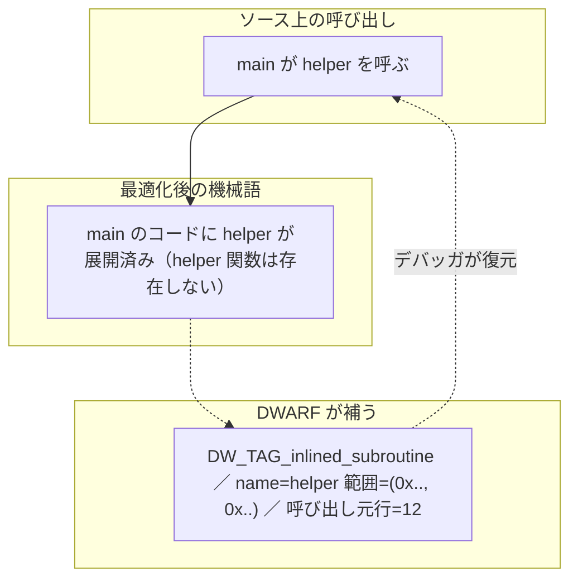

# 何が分かり、何が分からないか ―― DWARF の限界

本書がとくに大切にしたいのが、この章です。前章までで DWARF の仕組みを見てきましたが、DWARF は万能の「ソースとバイナリの完全な対応辞書」ではありません。**原理的に分かること、頑張れば分かること、そして分からないこと**には、はっきりした境界があります。この境界を理解することは、デバッガやプロファイラを作るとき、あるいは「なぜデバッグがうまくいかないのか」に悩むとき、決定的に重要です。

## DWARF から確実に分かること

まず、DWARF が（少なくとも最適化なし `-O0` でコンパイルした場合に）確実に答えられることを整理します。これらは前章までで見た仕組みから直接得られます。

- **アドレス ↔ ソース行**: 任意の命令アドレスが、どのファイルの何行目かを引ける。逆もできる（`.debug_line`）。
- **変数の名前・型・宣言位置**: 各スコープにどんな変数があり、型が何かを引ける（DIE と型 DIE）。
- **変数の場所と値**: その変数がいまレジスタかスタックのどこにあるかを場所式で求め、メモリ／レジスタから値を読める（`DW_AT_location`）。
- **関数の範囲と引数**: 各関数の開始・終了アドレス（`DW_AT_low_pc`/`DW_AT_high_pc`）、引数の名前と型。
- **コールスタックの巻き戻し**: 各アドレスで、呼び出し元のフレームをどう復元するか（`.debug_frame`/`.eh_frame`、後述）。

これだけでも、ブレークポイント・ステップ実行・変数表示・バックトレースという、デバッガの基本機能はすべて実装できます。`-O0` でビルドしてデバッグするぶんには、DWARF は期待どおりに働きます。

## コールフレーム情報 ―― 巻き戻しの仕組み

「分かること」の中で、少し補足が必要なのが**コールスタックの巻き戻し** (stack unwinding) です。バックトレース（`bt`）で呼び出し元をたどれるのはなぜでしょうか。

素朴には「各フレームはレジスタ rbp で連結されているから、それをたどればよい」と思うかもしれません。しかし最適化で rbp がフレームポインタとして使われなくなる（汎用レジスタに転用される）と、この鎖は切れます。そこで DWARF は、**任意の命令アドレスにおいて、呼び出し元のフレームと各レジスタの値をどう復元するか**を記述する表を持ちます。これが**コールフレーム情報** (Call Frame Information, CFI) で、`.debug_frame` あるいは（例外処理と共用の）`.eh_frame` に格納されます [DWARF, 2017](#cite:dwarf2017)。

CFI は、各アドレスについて「**CFA** (Canonical Frame Address、フレームの基準アドレス) はどのレジスタ + オフセットで求まるか」「戻りアドレスや退避されたレジスタは CFA からどこにあるか」を、行番号情報と同じく**状態機械を駆動するバイトコード**で表します。これにより、フレームポインタを使わないコードでも、関数の途中で止めても、正確に巻き戻せます。

> [!NOTE]
> `.eh_frame` は名前のとおり例外処理 (exception handling) 用に作られたもので、C++ の例外や `pthread_cancel` のために、デバッグ情報を `strip` した**リリースバイナリにも残ります**。そのため、デバッグ情報なしのスタックトレースでも、`.eh_frame` を読めば関数フレームの巻き戻し自体は可能です（ただし「行番号」や「変数」は分かりません）。プロファイラやクラッシュレポータが、最小限の情報でバックトレースを出せるのはこのおかげです。

## 最適化が壊すもの

ここからが本題です。コンパイラの最適化 (`-O2` など) を有効にすると、生成コードはソースコードと**素直に対応しなくなります**。DWARF は最適化後の状態を正直に記述しようとしますが、そもそも対応関係自体が複雑・不完全になるため、デバッグ体験が劣化します。主な現象を見ていきます。

**変数が消える (`<optimized out>`)。** 前章で触れたとおり、変数がレジスタにのみ存在し、しかもある区間では値がどこにも保持されないことがあります。そこで止めて値を見ようとすると、デバッガは `<optimized out>` と答えます。これは DWARF のバグでも、デバッガの手抜きでもありません。その瞬間、その値が機械のどこにも存在しないという**事実**を、DWARF が正直に（ロケーションリストの「穴」として）伝えているのです。

**行が飛ぶ・行ったり来たりする。** 命令スケジューリングやコードの並べ替えにより、ある行の命令が別の行の命令と入り混じります。ステップ実行すると、行番号が `10 → 12 → 10 → 13` のように前後し、混乱させられます。`.debug_line` の表自体は正しく、ある命令が確かにその行に由来することを示しているのですが、命令の順序がソースの順序と一致しないため、こう見えるのです。

**関数が消える（インライン化）。** 小さな関数は、呼び出し元に**インライン展開** (inlining) され、独立した関数としては存在しなくなります。すると、バックトレースから関数が消えたように見えます。DWARF はこれに `DW_TAG_inlined_subroutine` という DIE で対応し、「このアドレス範囲は、元は関数 `foo` を呼び出した結果が展開されたものだ」と記録します。賢いデバッガはこれを読んで、インライン化された関数も**仮想的なフレーム**としてバックトレースに表示します。つまり、インライン化は DWARF が頑張って追跡している領域です。

> [!CAUTION]
> 「最適化を有効にするとデバッグが難しくなる」とよく言われますが、その実態はここにあります。DWARF が情報を捨てているのではなく、**最適化によってソースと機械語の対応そのものが多対多に崩れ、もはや単純な対応辞書では表せなくなる**のです。DWARF はその崩れた対応を可能な限り記述しますが、「`x` の値は今いくつか」という問いに、もはや単一の答えが存在しないことがあります。これは形式の限界というより、最適化の本質から来る限界です。

## DWARF がそもそも記述しないこと

最適化以前に、DWARF が**設計上カバーしない**領域もあります。これらを期待してはいけません。

- **実行時の動的な値そのもの**: DWARF は「変数 `x` はここにある」という静的な記述です。「`x` が実行中に実際にどう変化したか」の履歴は持ちません。それは実行してみないと分かりません（だからこそデバッガで止めて読むのです）。
- **ヒープの構造**: `malloc` で確保した領域が「何の型の配列か」は、DWARF には基本的にありません。ポインタの**静的な型**は分かりますが、実行時にそれが指す先が何個並んでいるかは、一般には分かりません。
- **マクロ展開の完全な対応**（限定的）: `#define` 由来のコードがどの行かは曖昧になりがちです。DWARF にはマクロ情報セクション（`.debug_macro`）もありますが、利用は限定的です。
- **コンパイラが捨てた抽象**: ソースにあった型エイリアスや、テンプレートの実体化の一部など、コンパイラが早い段階で捨てた情報は復元できません。

> [!IMPORTANT]
> ここから導かれる実践的な指針: **「アドレス → 静的に決まる情報（行・型・場所の記述）」は DWARF で引けるが、「実行時に初めて決まる動的な情報（実際の値・実際に指す先・実際に通った経路）」は、DWARF だけでは決して分からない**。後者を知るには、DWARF を地図として使いつつ、実際に動いているプロセスのメモリやレジスタを読む（ptrace やコアダンプを使う）必要があります。DWARF は「どこを見ればよいか」を教える地図であって、「そこに何があったか」の記録ではないのです。

## まとめ ―― DWARF をどう信頼するか

この章の結論をまとめます。

- **`-O0` の世界では DWARF はほぼ完全**で、デバッガの基本機能はすべて素直に実装できる。
- **最適化された世界では、DWARF は正直だが不完全**になる。変数は消え、行は飛び、関数は溶ける。それは DWARF の欠陥ではなく、最適化による対応関係の崩壊を正直に映した結果である。
- **DWARF は静的な地図**であり、動的な実行時の事実そのものは含まない。値や経路を知るには、別途プロセスを観測する必要がある。

この「分かること・分からないことの境界」を持っておけば、デバッガの不可解な挙動に出会ったとき、それが「自分のミス」なのか「最適化に起因する原理的限界」なのかを切り分けられます。これは、言語処理系やツールを作る人にとって、何より価値のある勘所です [Bendersky, 2011](#cite:bendersky2011)。

ここまでが DWARF の「限界」 ―― 仕組みのうえで届かない境界の話でした。次章では視点を変え、本書が紙幅の都合で**扱わなかった DWARF 仕様**を地図として一望します。索引セクション、コールフレーム情報の中身、Split DWARF、言語ごとの表現など、「この先に何があるか」を押さえておけば、本格的なツールを作るときに迷いません。それを見届けてから、第 III 部のハンズオンへ進みましょう。
