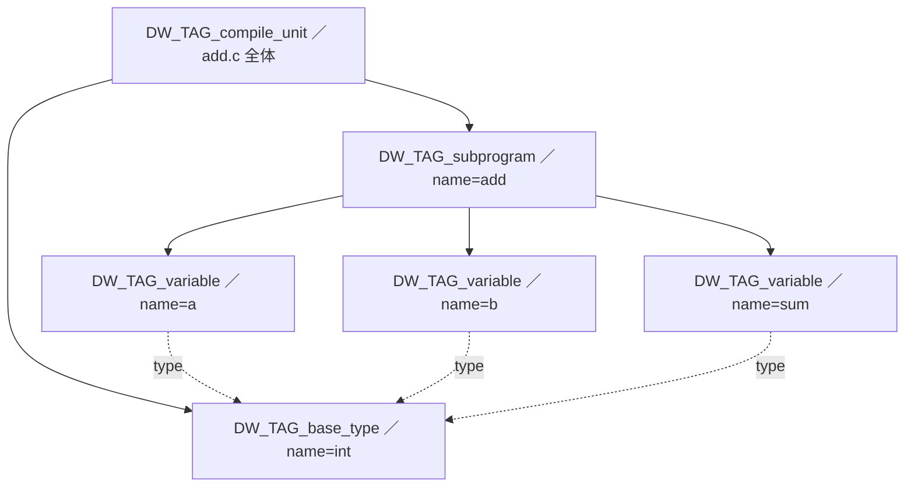

# DWARF の全体像 ―― なぜ、どこに、どんな形で

DWARF は、コンパイル後のプログラムと、それを書いた人間のソースコードとの間の「翻訳辞書」です。この章では細部に入る前に、DWARF が**なぜ必要か**、実行ファイルの**どこに**置かれるか、そして**どんな形で**情報を表現するのか、という全体像を描きます。

## デバッグ情報が解く問題

最適化なしでコンパイルした、ごく単純な関数を考えます。

```c
int add(int a, int b) {
    int sum = a + b;
    return sum;
}
```

これをコンパイルすると、`add` は十数バイトの機械語になります。その機械語の中に、`a`・`b`・`sum` という名前はもう存在しません。`a` は「スタックの先頭から 4 バイト下」、`sum` は「あるレジスタ」になっているかもしれませんが、それは命令の動きから暗黙に決まるだけで、対応表はどこにもありません。`int` という型情報も消えています。

ところがデバッガでこの関数を止めると、`print sum` で値が見られ、`print a` も効きます。なぜでしょうか。コンパイラが、コンパイル時に持っていた知識 ―― 「`sum` という名前の `int` 型の変数が、この関数のこの区間では、スタックのこの位置にある」 ―― を捨てずに、DWARF として書き出しておいたからです [Eager, 2012](#cite:eager2012)。

DWARF が答えられるようにするのは、おおむね次のような問いです。

- アドレス 0x1149 は、ソースの何という**ファイルの何行目**か。（行番号情報）
- いまこの関数には、どんな名前の**変数**があり、それぞれ**どこ**（レジスタ／スタック）にあるか。
- その変数の**型**は何で、サイズや構造はどうなっているか。
- ある関数は、どの関数から**呼ばれて**ここまで来たのか。（コールスタックの巻き戻し）

これらはすべて、機械語そのものには無い情報です。DWARF は、機械語のアドレスを鍵にして、これらの「人間の言葉」を引けるようにする仕組みなのです。

> [!NOTE]
> 「DWARF」という名前は、ELF（小人伝承の妖精／エルフ）に引っかけた洒落で、当初は公式の正式名称を持たない頭字語めいた愛称でした（後付けで "Debugging With Attributed Record Formats" と説明されることがあります）。名前の遊び心とは裏腹に、中身は緻密に設計された大規模な仕様です。本書では最新の第 5 版 [DWARF, 2017](#cite:dwarf2017) を基準にします。

## DWARF はどこに置かれるか

DWARF は単独のファイルではなく、第 I 部で学んだ ELF の**セクション**として格納されます。セクション名はすべて `.debug_` で始まり、用途ごとに分かれています。主要なものを挙げます。

| セクション | 内容 |
|---|---|
| `.debug_info` | DWARF の本体。変数・型・関数などの記述 |
| `.debug_abbrev` | `.debug_info` を圧縮するための「略号表」 |
| `.debug_str` | 名前などの文字列の格納先 |
| `.debug_line` | アドレスとソース行の対応表（行番号プログラム） |
| `.debug_line_str` | 行番号情報で使うファイル名文字列 |
| `.debug_loclists` | 変数の「場所」が区間で変わる場合の記述 |
| `.debug_ranges` / `.debug_rnglists` | アドレス範囲のリスト |
| `.debug_frame` / `.eh_frame` | スタック巻き戻し情報（CFI） |

これらのセクションには、第 4 章で見た `SHF_ALLOC` フラグが**立っていません**。つまり実行時にはメモリへ読み込まれず、プログラムの動作にも実行時メモリ消費にも影響しません。デバッガやプロファイラが、停止中・解析中のプロセスとは別に、ファイルから読み出して使うものです。だからこそ `strip` で丸ごと削除でき、削除しても動作は変わりません（デバッグできなくなるだけです）。

> [!TIP]
> リリース版のバイナリはデバッグ情報を含まないことが多いですが、別ファイル（`.debug` ファイルや debuginfo パッケージ）として配布されることがあります。DWARF 第 5 版は、デバッグ情報を本体から切り離して別管理する機能（split DWARF, `.debug_info.dwo` など）を強化しました。「動かす ELF は小さく、理解する DWARF は別に」という分離が進んでいるわけです。

## DWARF の表現方式 ―― DIE の木

DWARF が情報をどう表すか、その基本形を予告しておきます。DWARF は、プログラムのあらゆる要素 ―― コンパイル単位、関数、変数、型、… ―― を、**DIE** (Debugging Information Entry、デバッグ情報エントリ) という共通の単位で表します。

1 つの DIE は、次の 3 つから成ります。

- **タグ** (tag): その DIE が何を表すか。たとえば `DW_TAG_subprogram`（関数）、`DW_TAG_variable`（変数）、`DW_TAG_base_type`（基本型）。
- **属性** (attribute) の並び: 名前・型・場所などの性質。たとえば `DW_AT_name`（名前）、`DW_AT_type`（型への参照）、`DW_AT_location`（場所）。
- **子 DIE** の有無: DIE は入れ子になり、木構造を作る。

たとえば「`add` という関数があり、その中に `a`・`b`・`sum` という変数がある」という関係は、`add` を表す DIE の子として 3 つの変数 DIE がぶら下がる木として表されます。



この図には、DWARF の重要な性質が 2 つ表れています。第一に、**木構造**で入れ子のスコープを表現すること。関数の中の変数は関数 DIE の子になります。第二に、**参照による共有**です。`a`・`b`・`sum` はどれも `int` 型ですが、`int` を表す DIE は 1 つだけ作り、各変数の `DW_AT_type` 属性がそれを指します。型情報の重複を避ける、合理的な設計です。

次章では、この DIE の木が `.debug_info` と `.debug_abbrev` を使ってバイト列としてどう符号化されるのか、その仕掛けを具体的に見ていきます。DWARF が「冗長になりがちな情報を、いかにコンパクトに詰め込むか」に心を砕いた形式であることが分かるはずです。
