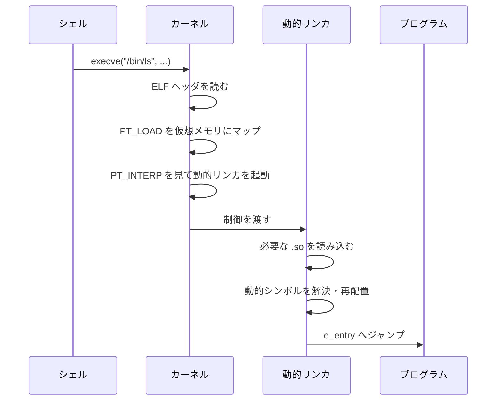
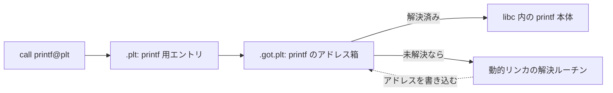

# ローディングと動的リンク ―― 実行ビューの世界

ここまでは主に「リンクビュー」、つまりセクションの世界を見てきました。この章では、もう一方の「実行ビュー」 ―― **プログラムヘッダ**と**セグメント** ―― に焦点を当てます。完成した実行ファイルが、どうやってメモリに読み込まれ、ライブラリと結びつき、実行を始めるのか。OS のローダの視点に立つことで、ELF の全体像が完成します。

## プログラムヘッダ Elf64_Phdr

実行ビューの目次が**プログラムヘッダテーブル**です。ELF ヘッダの `e_phoff` から始まり、`Elf64_Phdr`（56 バイト）の配列になっています [TIS, 1995](#cite:tis1995)。

```c
typedef struct {
    uint32_t p_type;     /* セグメントの種類 */
    uint32_t p_flags;    /* 保護属性（R/W/X） */
    uint64_t p_offset;   /* ファイル内オフセット */
    uint64_t p_vaddr;    /* 配置先の仮想アドレス */
    uint64_t p_paddr;    /* 物理アドレス（通常は無視） */
    uint64_t p_filesz;   /* ファイル上のバイト数 */
    uint64_t p_memsz;    /* メモリ上のバイト数 */
    uint64_t p_align;    /* アラインメント */
} Elf64_Phdr;
```

各エントリ 1 つが 1 つの**セグメント**を表します。意味の中心は次の 4 つです。「ファイルの `p_offset` から `p_filesz` バイトを、メモリの `p_vaddr` に写し取り、`p_memsz` バイト分の領域として `p_flags` の保護属性を付けよ」 ―― これがローダへの指示です。

ここで `p_filesz` と `p_memsz` が**別々のフィールド**である点に注目してください。多くのセグメントでは両者は等しいのですが、`.bss` を含むデータセグメントでは `p_memsz > p_filesz` になります。差分 `p_memsz - p_filesz` の領域は、ファイルには存在せず、ローダがゼロ埋めします。前章で見た `SHT_NOBITS`（`.bss`）の正体が、ここで実行ビューの言葉に翻訳されているわけです。

## セグメントの種類 p_type

`p_type` のうち、ローディングに関わる重要なものを挙げます。

| 値 | 名前 | 意味 |
|---|---|---|
| 1 | `PT_LOAD` | メモリに読み込むべきセグメント |
| 2 | `PT_DYNAMIC` | 動的リンク情報の所在 |
| 3 | `PT_INTERP` | インタプリタ（動的リンカ）のパス |
| 6 | `PT_PHDR` | プログラムヘッダ自身の所在 |
| 0x6474e551 | `PT_GNU_STACK` | スタックの実行可否を示す |

実際にメモリへ読み込まれるのは `PT_LOAD` のセグメントだけです。典型的な動的リンク実行ファイルには、`PT_LOAD` が複数（コード用とデータ用など）並びます。`p_flags` の値は `PF_X`(1)・`PF_W`(2)・`PF_R`(4) のビット和で、`R-X`（5）ならコード、`RW-`（6）ならデータ、と読めます。

`readelf -l`（`-l` はセグメント＝プログラムヘッダの意味）で、セグメントと、各セグメントにどのセクションが含まれるかの対応 (Section to Segment mapping) が見られます。

```
$ readelf -l /bin/ls
Program Headers:
  Type      Offset             VirtAddr           FileSiz   MemSiz    Flg Align
  LOAD      0x0000000000000000 0x0000000000000000 0x00003510 0x00003510 R   0x1000
  LOAD      0x0000000000004000 0x0000000000004000 0x00011281 0x00011281 R E 0x1000
  LOAD      0x0000000000034850 0x0000000000035850 0x000022d8 0x000038c0 RW  0x1000

 Section to Segment mapping:
   02     .text .rodata ...
   03     .data .bss ...
```

3 つ目の `LOAD` で `MemSiz`(0x38c0) > `FileSiz`(0x22d8) になっているのが、まさに `.bss` の分です。`.text` が `R E`（読み・実行）のセグメントに、`.data .bss` が `RW`（読み・書き）のセグメントにまとめられているのも、第 2 章で予告したとおりです。

## ローディングの流れ

では、`/bin/ls` を実行したとき、OS は何をするのでしょうか。大まかな流れは次のとおりです [Bryant, 2015](#cite:bryant2015)。



ポイントは、カーネルが直接プログラムを動かし始めるのではなく、まず**動的リンカ** (dynamic linker) を起動する点です。`PT_INTERP` セグメントには、動的リンカのパス（Linux では典型的に `/lib64/ld-linux-x86-64.so.2`）が文字列で書かれています。カーネルはまずこの動的リンカをメモリに載せて制御を渡し、動的リンカが必要な共有ライブラリを集めてから、ようやくプログラム本体のエントリポイント `e_entry` へジャンプするのです。

> [!NOTE]
> 「仮想メモリにマップする」とは、ファイルの一部をメモリ上のアドレスに対応づけることです。実際には `mmap` というシステムコールが使われ、ページが初めてアクセスされたときに必要な分だけファイルから読み込まれます（デマンドページング）。つまりローダはファイル全体を一気に読むのではなく、`PT_LOAD` の指示に従って「対応づけ」だけを設定し、中身は必要になってから遅延読み込みされます。だから巨大な実行ファイルでも起動は速いのです。

## 動的リンクと .dynamic セクション

動的リンカが「必要なライブラリ」「解決すべきシンボル」をどこから知るかというと、`PT_DYNAMIC` セグメント（実体は `.dynamic` セクション）です。ここには、動的リンクに必要な情報が**タグと値の組**の配列として並んでいます。各エントリは `Elf64_Dyn` 構造体です。

```c
typedef struct {
    int64_t d_tag;       /* 種類を表すタグ */
    uint64_t d_val_ptr;  /* 値またはアドレス */
} Elf64_Dyn;
```

代表的なタグには次のものがあります。`DT_NEEDED` が必要な共有ライブラリ、`DT_STRTAB`/`DT_SYMTAB` が動的文字列表・動的シンボル表の場所、`DT_RELA` が再配置テーブルの場所です。

| タグ | 意味 |
|---|---|
| `DT_NEEDED` | 必要な共有ライブラリ名（`.dynstr` へのオフセット） |
| `DT_STRTAB` | 動的文字列テーブル `.dynstr` のアドレス |
| `DT_SYMTAB` | 動的シンボルテーブル `.dynsym` のアドレス |
| `DT_RELA` | 再配置テーブルのアドレス |
| `DT_JMPREL` | 関数呼び出し用 PLT 再配置のアドレス |

`ldd` コマンドで `DT_NEEDED` を一覧できます。

```
$ ldd /bin/ls
        linux-vdso.so.1 (0x00007fff...)
        libc.so.6 => /lib/x86_64-linux-gnu/libc.so.6 (0x00007f...)
        /lib64/ld-linux-x86-64.so.2 (0x00007f...)
```

`libc.so.6` という行が、`/bin/ls` の `.dynamic` 内の `DT_NEEDED` に対応します。動的リンカはこれを見て libc を探し、メモリに載せ、`ls` が使う `printf` などのアドレスを `libc` 内の実体へ結びつけます。

## PLT と GOT ―― 遅延束縛のしくみ

最後に、動的リンクの実装でほぼ必ず登場する 2 つのテーブル、**GOT** と **PLT** に触れておきます。やや高度ですが、`readelf` でこれらの名前を見たときに「何のためのものか」が分かるよう、考え方だけ押さえます。

問題はこうです。コードセグメントは読み取り専用 (R-X) にしたい。しかし、`printf` の実体アドレスは実行時まで分からず、後から書き込む必要がある。読み取り専用のコードに、どうやって後からアドレスを埋めるのでしょうか。

解決策は**間接参照**です。コードは `printf` を直接呼ばず、書き換え可能なデータ領域にある「アドレスを入れる箱」を経由して呼びます。この箱の集まりが **GOT** (Global Offset Table、`.got` / `.got.plt`) で、データセグメント側にあるので書き換え可能です。そして、各外部関数ごとに用意された小さなコード断片の集まりが **PLT** (Procedure Linkage Table、`.plt`) です [Drepper, 2011](#cite:drepper2011)。



初めて `printf` を呼ぶとき、GOT の箱はまだ本体アドレスを持っていません。代わりに動的リンカの解決ルーチンに飛び、そこで本体アドレスを求めて GOT の箱に書き込みます。2 回目以降は GOT に正解が入っているので、直接 `printf` に飛べます。このように「必要になって初めて解決する」方式を**遅延束縛** (lazy binding) と呼びます。最初の 1 回だけ解決のコストを払い、以後は間接ジャンプ 1 回で済む、という工夫です。

> [!CAUTION]
> GOT は実行中に書き換えられる、攻撃者にとって魅力的な標的です。そこで近年は、起動時にすべての GOT を解決して読み取り専用に固める **Full RELRO** (RELocation Read-Only) という緩和策が広く使われます。`readelf -l` の出力に `GNU_RELRO` というセグメントが見えたら、それがこの保護の現れです。セキュリティを学ぶ上でも、GOT/PLT の理解は出発点になります。

## ELF 部のまとめ

第 I 部を振り返りましょう。ELF ファイルには 2 つのビューがありました。**リンクビュー**（セクション）はリンカのための細かい区分けで、シンボルと再配置によって「名前」を「アドレス」に変える舞台でした。**実行ビュー**（セグメント／プログラムヘッダ）はローダのための粗い区分けで、メモリへの配置と保護属性、そして動的リンクの起点となりました。ELF ヘッダはその両方への入口でした。

これで「実行ファイルとは、メモリにどう配置すべきかが書かれたバイト列だ」という見通しが得られたはずです。しかし、この ELF だけでは答えられない問いがあります ―― 「いま停止しているこのアドレスは、ソースの何行目か」「このメモリ番地に入っている値は、どの変数で、型は何か」。これらに答えるのが、続く第 II 部で扱う **DWARF** です。

ただし DWARF に進む前に、次章でいったん立ち止まります。本書の ELF 部は実用の核心に絞ったため、シンボルバージョニング・TLS・ノート・コアダンプといった、実務で必ず出会う仕様をあえて扱いませんでした。次章ではそれらを**地図**として一望し、「この先に何があるか」を押さえておきます。それが済んだら、ELF という器の上に人間がプログラムを理解するための情報がどう乗っているのかを、第 II 部で見ていきましょう。
