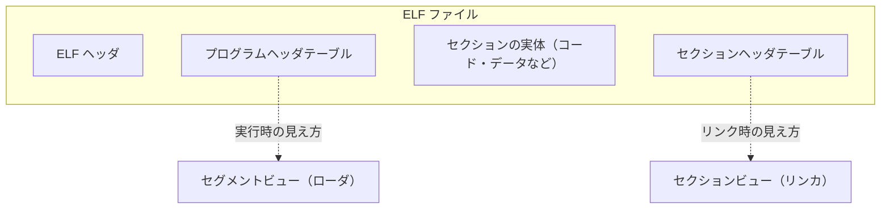

# ELF の全体像 ―― 2 つの見え方

ELF を理解するうえで最初に、そして最も重要なのが、**1 つの ELF ファイルには 2 つの異なる「見え方」がある**という事実です。この二重性を最初につかんでおくと、後で出てくる細かい構造の役割がすべて腑に落ちます。この章では細かいバイト位置にはまだ立ち入らず、その全体像を描きます。

## ファイルの 3 種類と 2 つのビュー

ELF ファイルには、用途によって主に 3 つの種類があります [TIS, 1995](#cite:tis1995)。

| 種類 | 英語名 | 例 | 役割 |
|------|--------|----|----|
| 再配置可能ファイル | relocatable file | `hello.o` | リンカへの入力。他のファイルとリンクされる前の部品。 |
| 実行可能ファイル | executable file | `a.out`, `/bin/ls` | そのまま実行できる完成品。 |
| 共有オブジェクトファイル | shared object file | `libc.so` | 実行時に動的にリンクされるライブラリ。 |

同じ ELF という枠組みでこれらすべてを表現できるのがポイントです。そして、これらを横断する考え方が「**2 つのビュー**」です。

ELF 仕様は、ファイルを次の 2 つの観点から記述します。

- **リンクビュー** (linking view): ファイルを**セクション** (section) の集まりとして見る。リンカがこの見方をする。
- **実行ビュー** (execution view): ファイルを**セグメント** (segment) の集まりとして見る。ローダ（OS）がこの見方をする。

セクションとセグメントは、同じファイルの中身を**別々の切り口で区分けしたもの**です。1 つのバイト列を、リンカは「セクション」という細かい単位で扱い、ローダは「セグメント」という粗い単位で扱う、と考えてください。

## なぜビューが 2 つあるのか

なぜわざわざ 2 つの見方を用意するのでしょうか。それは、**リンカとローダで関心が違う**からです。

リンカは、コードとデータを細かく分類したい。実行可能な機械語、初期値のあるグローバル変数、初期値が 0 のグローバル変数、定数の文字列、シンボル表、再配置情報……これらをそれぞれ別の箱に入れておくと、複数のオブジェクトファイルを結合するときに「コードはコードどうし、データはデータどうし」と束ねやすくなります。この細かい箱が**セクション**です [Levine, 2000](#cite:levine2000)。

一方ローダは、そんな細かい分類には興味がありません。ローダが知りたいのは、「このバイト範囲を、メモリのこのアドレスに、**読み取り専用で**置け」「この範囲は、このアドレスに**読み書き可能で**置け」という、メモリ保護属性ごとのまとまりだけです。CPU のメモリ保護はページ単位（典型的には 4 KiB）で効くので、属性が同じセクションをまとめて 1 つの**セグメント**にしておくと、効率よくメモリに配置できます。

> [!NOTE]
> **メモリ保護属性**とは、あるメモリ領域が「読めるか (R)」「書けるか (W)」「実行できるか (X)」を定める設定です。たとえばプログラムのコードは「読める・実行できるが書けない」(R-X) ことで、悪意あるコードによる書き換えを防ぎます。逆にデータ領域は「読める・書けるが実行できない」(RW-) とすることで、データを誤って実行してしまう攻撃を防ぎます。

つまり、典型的には次のような対応になります。複数のセクションが 1 つのセグメントにまとめられている点に注目してください。

| セグメント（実行ビュー） | 含まれる主なセクション（リンクビュー） | 保護属性 |
|----|----|----|
| コードセグメント | `.text`, `.rodata`, `.init` ほか | R-X |
| データセグメント | `.data`, `.bss`, `.got` ほか | RW- |

## ELF ファイルの 4 つの構成要素

これらを踏まえると、ELF ファイルは大きく 4 つの部分から成る、と整理できます。先ほどの図を言葉にすると次のとおりです。

1. **ELF ヘッダ** (ELF header): ファイルの先頭にある、いわば「目次の目次」。このファイルが何ビット用か、どのアーキテクチャ用か、エントリポイントはどこか、そして後述する 2 つのテーブルがファイルのどこにあるか、を記す。必ず存在する。
2. **プログラムヘッダテーブル** (program header table): 実行ビューの目次。各セグメントの情報（ファイル内オフセット、メモリ上のアドレス、サイズ、保護属性）を並べた配列。実行ファイルと共有オブジェクトには必須、`.o` には通常無い。
3. **セクションの実体**: コードやデータの本体。ファイルの大半を占める。
4. **セクションヘッダテーブル** (section header table): リンクビューの目次。各セクションの情報（名前、種類、ファイル内オフセット、サイズなど）を並べた配列。`.o` には必須、実行ファイルにもふつう存在するが、`strip` で削除できる。

> [!TIP]
> 「再配置可能ファイル（`.o`）にはプログラムヘッダが無く、実行ファイルにはあるが、セクションヘッダはどちらにもある（ことが多い）」という非対称性は、2 つのビューの役割から自然に説明できます。`.o` はまだリンクされておらず実行できないので、実行ビュー（プログラムヘッダ）が不要なのです。逆に、完成した実行ファイルからセクションヘッダ（リンクビュー）を削っても、実行そのものには支障がありません。

## 本書での ELF の歩き方

次章以降は、この 4 要素を順に詳しく見ていきます。具体的には次の道筋をたどります。

- **ELF ヘッダ**（次章）: ファイルの先頭 64 バイトを 1 バイトずつ読む。ここを読めれば、2 つのテーブルの場所が分かり、残りすべてに到達できる。
- **セクション**: セクションヘッダテーブルの構造と、`.text` / `.data` / `.bss` / `.rodata` といった主要セクションの意味。
- **シンボルと再配置**: 名前とアドレスを結びつける仕組み。リンカの心臓部。
- **ローディングと動的リンク**: プログラムヘッダと、実行時にライブラリが結びつく仕組み。

これらを読み終えれば、最後のハンズオン（第 III 部）で、C 言語の小さなプログラムから ELF を直接生成したり解析したりできるようになります。それでは、ファイルの一番先頭、ELF ヘッダから始めましょう。
