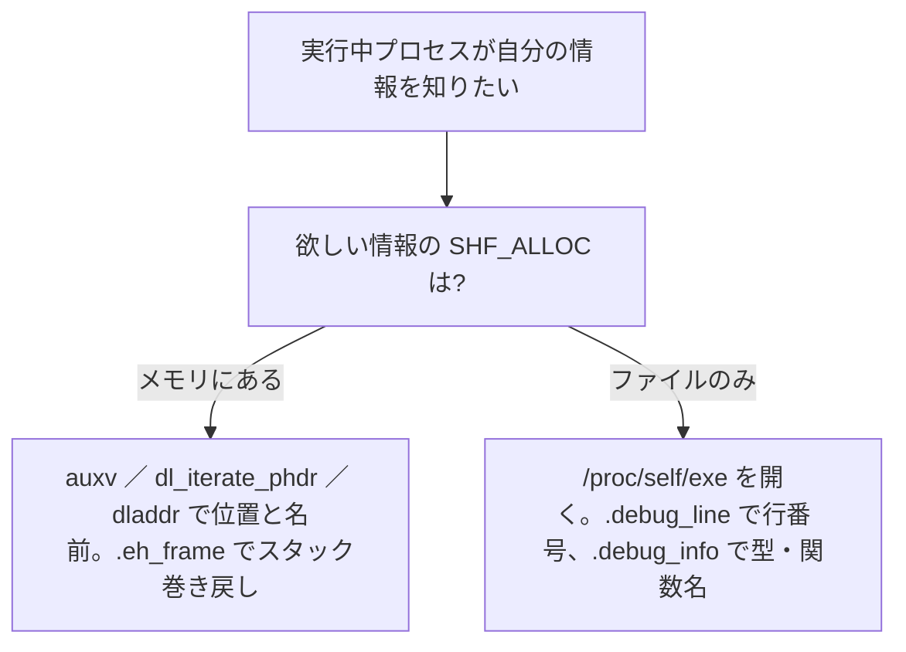

# ハンズオン(2) アドレスから行番号を引く

最後のハンズオンは、DWARF の `.debug_line` を実際に解釈して、**機械語アドレスからソースの行番号を求める**ツールです。`addr2line` のいちばん核心の部分にあたります。第 11 章で学んだ「行番号状態機械」を、本物のバイナリの本物のバイトコードに対して動かします。これが動けば、DWARF の行番号情報は「読めた」と言ってよいでしょう。

## 方針 ―― 状態機械を実行する

第 11 章で見たとおり、`.debug_line` には「アドレス → 行」の表そのものではなく、その表を生成する**バイトコード**が入っています。したがって私たちがやるべきことは、

1. `.debug_line` セクションを取り出す（前章の `read_section` を再利用）。
2. 各コンパイル単位（CU）のヘッダを読み、状態機械のパラメータ（`line_base`・`line_range` など）を得る。
3. バイトコードを 1 命令ずつ実行し、行が出力されるたびに `(アドレス, 行)` の組を得る。
4. 問い合わせアドレス以下で最大のアドレスを持つ行を選び、それが答えの行番号。

の 4 つです。3 が第 11 章の状態機械そのもの、4 が `addr2line` のアドレス検索です。

## 部品: LEB128 と多バイト整数

DWARF のバイトコードには、第 9 章で説明した LEB128（可変長整数）が頻出します。まずその復号関数を用意します。ポインタへのポインタ `uint8_t **p` を渡し、読んだ分だけポインタを前進させる形にしておくと、バイト列を順に消費していくのに便利です。

```c
/* LEB128（符号なし） */
static uint64_t read_uleb(uint8_t **p) {
    uint64_t r = 0; int s = 0; uint8_t b;
    do { b = *(*p)++; r |= (uint64_t)(b & 0x7f) << s; s += 7; } while (b & 0x80);
    return r;
}
/* LEB128（符号付き） */
static int64_t read_sleb(uint8_t **p) {
    int64_t r = 0; int s = 0; uint8_t b;
    do { b = *(*p)++; r |= (int64_t)(b & 0x7f) << s; s += 7; } while (b & 0x80);
    if (s < 64 && (b & 0x40)) r |= -((int64_t)1 << s);
    return r;
}
```

各バイトの下位 7 ビットを集め、最上位の継続ビットが 0 になるまで繰り返す ―― 第 9 章の説明どおりです。符号付き版は、最後のバイトの符号ビット（0x40）が立っていれば、残りの上位ビットを 1 で埋めて負数にします。これで `DW_LNS_advance_line` の負の増分も正しく読めます。

固定長の多バイト整数も読みます。セクションのバイト列は途中で 2 バイト境界などに揃っているとは限らないので、`memcpy` でアラインメントに依存せず取り出します。

```c
static uint32_t u32(uint8_t *p) { uint32_t v; memcpy(&v, p, 4); return v; }
static uint16_t u16(uint8_t *p) { uint16_t v; memcpy(&v, p, 2); return v; }
static uint64_t u64(uint8_t *p) { uint64_t v; memcpy(&v, p, 8); return v; }
```

## 行番号ヘッダを読む

`.debug_line` は CU ごとの単位の連結です。各単位はヘッダから始まります（第 11 章「行番号ヘッダ」）。ここで一つ、実装を大幅に楽にする工夫を使います。ヘッダには `header_length` というフィールドがあり、これは「このフィールドの直後から、行番号プログラム本体の先頭までのバイト数」を表します。つまり、`header_length` の分だけ読み飛ばせば、**ディレクトリ表やファイル名表を一切解釈せずに、プログラム本体へ直接ジャンプできる**のです。

```c
    while (p < end) {                    /* CU ごとの行番号プログラム */
        uint32_t unit_len = u32(p); p += 4;
        uint8_t *unit_end = p + unit_len;
        uint16_t ver = u16(p); p += 2;
        if (ver >= 5) p += 2;            /* address_size, segment_selector_size */
        uint32_t header_len = u32(p); p += 4;
        uint8_t *prog = p + header_len;  /* header_length で本体へ直接ジャンプ */
        uint8_t  min_inst = *p++;
        if (ver >= 4) p++;               /* maximum_operations_per_instruction */
        p++;                             /* default_is_stmt */
        int8_t   line_base = (int8_t)*p++;
        uint8_t  line_range = *p++;
        uint8_t  opcode_base = *p++;
        uint8_t *std_lens = p;

        p = prog;                        /* ディレクトリ／ファイル表は読み飛ばす */
```

ここで取り出した `min_inst`（最小命令長）、`line_base`・`line_range`（特別オペコードの計算用）、`opcode_base`（標準オペコードの個数 + 1）は、いずれも第 11 章で名前を挙げたパラメータです。`std_lens` は各標準オペコードが取る引数の個数表で、知らない標準オペコードに出会ったときに正しく読み飛ばすために使います。`ver`（バージョン）によってヘッダ構造が少し違うので、第 5 版とそれ以前を分岐しています（第 9 章のコラムで注意したとおりです）。

> [!NOTE]
> `header_length` を使ってファイル名表を読み飛ばす、というのは実用上のショートカットです。本来 `addr2line` は、状態機械の `file` レジスタからファイル名も解決して「ファイル名:行番号」を出します。そのためにはファイル名表（第 5 版では形式記述子付き）を解釈する必要があり、相応のコード量になります。本章では DWARF の中核である「状態機械の実行」に集中するため、ファイル名解決は省き、**行番号**だけを求めます。ファイル名表を読む処理は、同じ「形式に従って値を読む」技法（第 9 章の `DW_FORM_*`）の応用問題として、よい練習になります。

## 状態機械を駆動する

いよいよ本体です。`address` と `lineno` の 2 つのレジスタを持ち、バイトコードを 1 命令ずつ実行します。第 11 章で説明した「拡張・標準・特別」の 3 種類のオペコードを、それぞれ処理します。

```c
        /* 状態機械を駆動する */
        uint64_t address = 0; int64_t lineno = 1;
        while (p < unit_end) {
            uint8_t op = *p++;
            if (op == 0) {                       /* 拡張オペコード */
                uint64_t len = read_uleb(&p);
                uint8_t *nxt = p + len;
                uint8_t sub = *p++;
                if (sub == 2) address = u64(p);  /* DW_LNE_set_address */
                else if (sub == 1) { address = 0; lineno = 1; } /* end_sequence */
                p = nxt;
            } else if (op < opcode_base) {        /* 標準オペコード */
                switch (op) {
                case 1: /* DW_LNS_copy → 1 行出力 */
                    if (address <= query && address >= best_addr) {
                        best_addr = address; best_line = lineno; found = 1;
                    }
                    break;
                case 2: address += read_uleb(&p) * min_inst; break; /* advance_pc */
                case 3: lineno  += read_sleb(&p); break;            /* advance_line */
                case 4: read_uleb(&p); break;                       /* set_file */
                case 5: read_uleb(&p); break;                       /* set_column */
                case 8: address += ((255 - opcode_base) / line_range) * min_inst; break;
                case 9: address += u16(p); p += 2; break;           /* fixed_advance_pc */
                case 12: read_uleb(&p); break;                      /* set_isa */
                default:
                    for (int k = 0; k < std_lens[op-1]; k++) read_uleb(&p);
                }
            } else {                              /* 特別オペコード → 1 行出力 */
                uint8_t adj = op - opcode_base;
                address += (adj / line_range) * min_inst;
                lineno  += line_base + (adj % line_range);
                if (address <= query && address >= best_addr) {
                    best_addr = address; best_line = lineno; found = 1;
                }
            }
        }
        p = unit_end;
    }
```

3 種類のオペコードの処理を、第 11 章の説明と対応させて読み解きます。

**拡張オペコード**（先頭バイトが 0）は、続く長さと副オペコード番号で識別します。`DW_LNE_set_address`（副オペコード 2）は、続く 8 バイトを絶対アドレスとして `address` に設定します。関数の先頭などで、増分では効率の悪い大きなジャンプをするのに使われます。`DW_LNE_end_sequence`（副オペコード 1）は、連続アドレス列の終端で、レジスタをリセットします。

**標準オペコード**（1 以上 `opcode_base` 未満）は、第 11 章の表に挙げた命令です。`DW_LNS_copy`(1) が「いまのレジスタを 1 行出力」、`advance_pc`(2) がアドレスを進め、`advance_line`(3) が行番号を増減させます。`set_file`(4)・`set_column`(5) は引数を読み飛ばすだけ（ファイル・列は今回使いません）。知らない標準オペコードは、`std_lens` を見て引数の個数分だけ ULEB を読み飛ばします ―― これにより、未対応の命令があってもバイト位置がずれません。

**特別オペコード**（`opcode_base` 以上）は、第 11 章で説明した「アドレスを少し進め、行を少し増減し、1 行出力」を 1 バイトで行うものです。`adj = op - opcode_base` から、`address` の増分と `lineno` の増分を、`line_base`・`line_range` を使った計算式で割り出します。この 1 バイトに 3 つの動作が圧縮されているおかげで、行番号プログラムは非常にコンパクトになるのでした。

「1 行出力」の箇所では、表を保存する代わりに、その場で「問い合わせアドレス `query` 以下で、これまでで最大のアドレスか」を判定し、そうなら答えの候補を更新しています。表全体を組み立てなくても、この貪欲な更新だけで「`query` 以下で最大のアドレスの行」が求まります。これが `addr2line` のアドレス検索の本質です。

## main で組み立てる

残りは、ファイルを開き、`.debug_line` を取り出し（前章の `read_section` を再利用）、上のループを回して結果を表示するだけです。

```c
int main(int argc, char **argv) {
    if (argc < 3) { fprintf(stderr, "usage: %s ELF ADDR\n", argv[0]); return 1; }
    uint64_t query = strtoull(argv[2], NULL, 0);
    FILE *fp = fopen(argv[1], "rb");
    if (!fp) { perror("fopen"); return 1; }
    Elf64_Ehdr eh;
    must_read(&eh, sizeof eh, 1, fp);

    uint64_t sz; uint8_t *line = read_section(fp, ".debug_line", &eh, &sz);
    if (!line) { fprintf(stderr, "no .debug_line section\n"); return 1; }

    uint64_t best_addr = 0, best_line = 0; int found = 0;
    uint8_t *p = line, *end = line + sz;

    /* ... 上で示した while (p < end) のループ ... */

    if (found)
        printf("0x%lx  ->  line %lu  (行の先頭アドレス 0x%lx)\n",
               query, best_line, best_addr);
    else
        printf("0x%lx  ->  行情報が見つかりません\n", query);
    return 0;
}
```

`read_section` は、前章のミニ readelf で書いたものを、指定した名前のセクションを返すように一般化したものです（セクション名を `.shstrtab` で解決し、目的のセクションの `sh_offset`/`sh_size` から本体を読む、という処理は同じです）。

## 動かして確かめる

第 11 章で `readelf --debug-dump=decodedline` が示した表を思い出してください。`sample` では、行 3 が 0x401136、行 5 が 0x40114f、行 9 が 0x401160、行 10 が 0x401172 から始まっていました。私たちのツールが同じ答えを出すか、確かめます。

```
$ gcc -Wall -Wextra -o miniaddr2line miniaddr2line.c
$ ./miniaddr2line sample 0x401136
0x401136  ->  line 3  (行の先頭アドレス 0x401136)
$ ./miniaddr2line sample 0x40114f
0x40114f  ->  line 5  (行の先頭アドレス 0x40114f)
$ ./miniaddr2line sample 0x401160
0x401160  ->  line 9  (行の先頭アドレス 0x401160)
$ ./miniaddr2line sample 0x401172
0x401172  ->  line 10  (行の先頭アドレス 0x401172)
```

本物の `addr2line` と比べてみましょう。

```
$ addr2line -e sample 0x401136 0x40114f 0x401160 0x401172
.../sample.c:3
.../sample.c:5
.../sample.c:9
.../sample.c:10
```

行番号が完全に一致しました。私たちの数十行のコードは、`.debug_line` のバイトコードを正しく実行し、本物のツールと同じ結果を出せています。行のちょうど先頭でないアドレス、たとえば `0x401140` を問い合わせても、「`query` 以下で最大のアドレス」を選ぶので、ちゃんとその命令が属する行を答えます。

> [!TIP]
> ここまで来たら、ぜひ自分で拡張してみてください。第 9 章・第 10 章で学んだ `.debug_info` と `.debug_abbrev` を読めば、アドレスから**関数名**を引けます（関数 DIE の `DW_AT_low_pc`/`DW_AT_high_pc` の範囲に問い合わせアドレスが入るものを探す）。さらにファイル名表を解釈すれば、`file:line` の完全な `addr2line` になります。本書の知識は、すでにそのすべての出発点を与えています。

## 発展: 実行中のプロセスが「自分自身」の情報にたどり着く

ここまでの `miniaddr2line` は、コマンド引数で渡された ELF ファイルを `fopen` で開いて読みました。では、解析したい対象が**いま動いているプロセス自身**だったらどうでしょうか。クラッシュした瞬間に自分でバックトレースを出すクラッシュハンドラや、自分のスタックを定期的に覗くプロファイラは、まさにこれをやっています。「実行中のプロセスは、自分の ELF/DWARF 情報にたどり着けるのか、たどり着けるならどうやってか」 ―― 本書の締めくくりに、この問いへ答えておきます。

鍵は、第 4 章で学んだ `SHF_ALLOC` フラグです。このフラグの有無で、情報へたどり着く道が二手に分かれます。

### 道その 1 ―― メモリに載っている情報は、そのまま使う

`SHF_ALLOC` が立つセクションは、実行時にプロセスのアドレス空間へマップされ、動的リンカ自身が使っています。だから自分のコードからも、ファイルを開かずに直接届きます。入口は主に次の 3 つです。

- **補助ベクタ (auxv)**: カーネルがプロセス起動時にスタックへ積む情報です。これを引く `getauxval()`（標準 libc ではなく **glibc の GNU 拡張**。`<sys/auxv.h>` で宣言、musl や Bionic にもある）に `AT_PHDR` / `AT_PHNUM` を渡すと、自分の**プログラムヘッダがメモリのどこにあるか**を一発で得られます。ここがすべての出発点です。
- **`dl_iterate_phdr()`**: 自分自身と、読み込み済みのすべての共有ライブラリのプログラムヘッダを列挙する libc 関数です。「このアドレスはどのモジュールの、どのセグメントか」を特定するのに使い、アンワインダの最初の一歩になります。
- **動的シンボル経由**: `dladdr()` は「このアドレスはどの関数か」を、`dlsym()` は「この名前のアドレスは」を答えます。いずれも `SHF_ALLOC` 付きの `.dynsym`/`.dynstr` をその場で引いています。

そして DWARF のうち `.eh_frame`（コールフレーム情報の例外処理版。第 12 章）も `SHF_ALLOC` 付きでメモリにあります。C++ の例外や `backtrace()` が実行時にスタックを巻き戻せるのは、これをメモリから読んでいるからで、`strip` 後のバイナリでも機能します。

### 道その 2 ―― 載っていない情報は、自分のファイルを開いて読む

一方、**セクションヘッダ・`.symtab`・`.debug_*` は `SHF_ALLOC` が立たず**（第 4 章、および第 8 章で見たとおり）、メモリには存在しません。これらを使いたいプロセスは、結局のところ**自分自身の実行ファイルを開いて、外部ツールと同じようにパース**します。本章で作った `miniaddr2line` の処理を、対象＝自分にするだけです。

その入口が `/proc/self/exe` です。これは「いま実行中の自分の ELF ファイル」を指すシンボリックリンクで、`fopen("/proc/self/exe", "rb")` とすれば、`miniaddr2line` の `main` がやっていたのとまったく同じ要領で `.debug_line` を読み、アドレスを行番号へ変換できます（auxv の `AT_EXECFN` からパスを得る手もあります）。`strip` 済みでデバッグ情報が本体に無いときは、第 7 章で触れた `.note.gnu.build-id` を鍵に、別ファイルの debuginfo を引き当てます。



### 組み合わせると ―― 自前バックトレースの全体像

この 2 つの道を合わせると、デバッグ情報なしでも動く自前バックトレースの骨格が見えます。たとえば `SIGSEGV` を受け取ったハンドラは、まず道その 1（`.eh_frame` と `dl_iterate_phdr`）で各フレームの戻りアドレスを次々に巻き戻し、続いて道その 2（`/proc/self/exe` の `.debug_line`）で各アドレスを `file:line` に変換します。glibc の `backtrace()`、libunwind、各種サニタイザの in-process シンボル化は、まさにこの組み合わせで動いています。

> [!NOTE]
> DWARF はあくまで「どこを見ればよいか」を示す**地図**でした（第 12 章）。自分のプロセスなら、地図が指すメモリやレジスタの**実体**をそのまま読めるので、変数の実際の値まで取り出せます。これが他プロセスの解析（`ptrace`）やコアダンプ（第 7 章）との違いで、コアダンプは「死んだ瞬間のメモリとレジスタを ELF に固めたもの」を後から地図と突き合わせて読む、という関係になります。あなたが本書で身につけた読み方は、生きたプロセスにも、その亡骸にも、同じように通用します。

## おわりに

本書は、ELF ヘッダの先頭 16 バイトから始めて、セクション、シンボル、ローディングと ELF を一巡し、続いて DWARF の DIE・型・場所式・行番号情報をたどり、最後にその知識で `readelf` と `addr2line` の核心を自作するところまで来ました。

振り返ると、一貫していたのは「**バイナリは、仕様という約束に従って切り分ければ読める**」という一点です。最初は意味不明に見えたバイト列が、`7f 45 4c 46` というマジックから始まり、オフセットをたどり、可変長整数を復号し、状態機械を回すことで、関数名や行番号という人間の言葉に戻っていく ―― その全過程を、あなたは自分の手で再現しました。

DWARF については、第 12 章で「分かること・分からないこと」の境界も学びました。`-O0` のバイナリなら今回のように行番号がきれいに引けますが、最適化された世界では変数が消え、行が飛びます。それは DWARF の限界というより、最適化がソースと機械語の対応そのものを崩すからでした。この勘所を持っていれば、デバッガの不可解な挙動にも臆さず向き合えるはずです。

ここから先は、`.eh_frame` を読んでスタックを巻き戻すバックトレーサ、`.debug_info` を歩く型ビューア、あるいは ptrace と組み合わせた小さなデバッガ ―― どんな方向にも進めます。バイナリの中身は、もうあなたにとって「読めないもの」ではありません。
