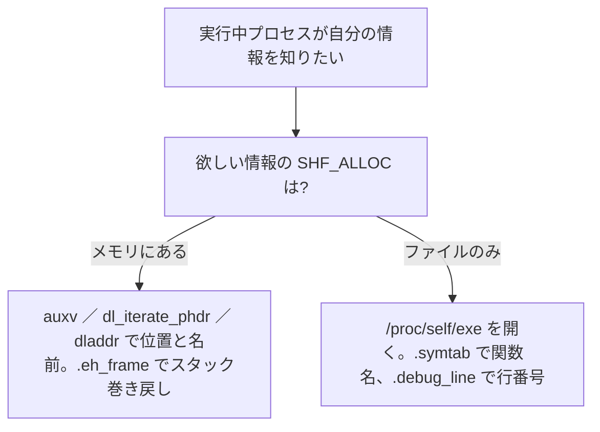

# ハンズオン(5) 動いているプロセスを覗く ―― 全スレッドのリッチなバックトレース

5 つめのハンズオンです。前章の `miniaddr2line` は、コマンド引数で渡された ELF ファイルを `fopen` で開いて読みました。今度は読む相手を、**いま動いているプロセス自身**に変えます。作るのは、`glibc` の `backtrace()` よりずっとリッチなバックトレースです。`backtrace()` は現在スレッドの**生のアドレス列**しか返しませんが、私たちのツールは各フレームの**関数名**と**ソース行**を付け、しかもマルチスレッドなら**全スレッド分**を出します。クラッシュハンドラやプロファイラが裏でやっていることそのものです。

## 自分自身の情報にどうたどり着くか

「実行中のプロセスは、自分の ELF/DWARF 情報にたどり着けるのか、たどり着けるならどうやってか」 ―― まずこの問いに答えます。鍵は、[](elf-sections.md)で学んだ `SHF_ALLOC` フラグです。このフラグの有無で、情報へたどり着く道が二手に分かれます。

### 道その 1 ―― メモリに載っている情報は、そのまま使う

`SHF_ALLOC` が立つセクションは、実行時にプロセスのアドレス空間へマップされ、動的リンカ自身が使っています。だから自分のコードからも、ファイルを開かずに直接届きます。入口は主に次の 3 つです。

- **補助ベクタ (auxv)**: カーネルがプロセス起動時にスタックへ積む情報です。これを引く `getauxval()`（標準 libc ではなく **glibc の GNU 拡張**。`<sys/auxv.h>` で宣言、musl や Bionic にもある）に `AT_PHDR` / `AT_PHNUM` を渡すと、自分の**プログラムヘッダがメモリのどこにあるか**を一発で得られます。
- **`dl_iterate_phdr()`**: 自分自身と、読み込み済みのすべての共有ライブラリのプログラムヘッダを列挙する libc 関数です。「このアドレスはどのモジュールの、どのセグメントか」を特定するのに使い、アンワインダの最初の一歩になります。
- **動的シンボル経由**: `dladdr()` は「このアドレスはどの関数か」を、`dlsym()` は「この名前のアドレスは」を答えます。いずれも `SHF_ALLOC` 付きの `.dynsym`/`.dynstr` をその場で引いています。

そして DWARF のうち `.eh_frame`（コールフレーム情報の例外処理版。[](dwarf-limits.md)）も `SHF_ALLOC` 付きでメモリにあります。C++ の例外や `backtrace()` が実行時にスタックを巻き戻せるのは、これをメモリから読んでいるからで、`strip` 後のバイナリでも機能します。

### 道その 2 ―― 載っていない情報は、自分のファイルを開いて読む

一方、**セクションヘッダ・`.symtab`・`.debug_*` は `SHF_ALLOC` が立たず**（[](elf-sections.md)、および[](dwarf-overview.md)で見たとおり）、メモリには存在しません。これらを使いたいプロセスは、結局のところ**自分自身の実行ファイルを開いて、外部ツールと同じようにパース**します。前章で作った `miniaddr2line` の処理を、対象＝自分にするだけです。

その入口が `/proc/self/exe` です。これは「いま実行中の自分の ELF ファイル」を指すシンボリックリンクで、`fopen("/proc/self/exe", "rb")` とすれば、`miniaddr2line` の `main` がやっていたのとまったく同じ要領で `.symtab` や `.debug_line` を読めます。本章はこの**道その 2** を歩きます ―― 自分の `.symtab` で関数名を、`.debug_line` で行番号を引き、フレームポインタでスタックを巻き戻すのです。



## 部品: 自分の表を読む

まず、自分の ELF から「アドレス → 関数名」と「アドレス → 行番号」を引く部品を用意します。セクションを名前で取り出す `read_section` は、[](handson-dwarf.md)で作ったものをそのまま使います。

```c
#define _GNU_SOURCE
#include <stdio.h>
#include <stdlib.h>
#include <stdint.h>
#include <string.h>
#include <elf.h>
#include <unistd.h>
#include <dirent.h>
#include <signal.h>
#include <semaphore.h>
#include <pthread.h>
#include <ucontext.h>
#include <sys/syscall.h>

static void must_read(void *buf, size_t size, size_t n, FILE *fp) {
    if (fread(buf, size, n, fp) != n) { fprintf(stderr, "read error\n"); exit(1); }
}

/* ハンズオン(4) の read_section をそのまま使う（名前でセクション本体を返す） */
static uint8_t *read_section(FILE *fp, const char *name,
                             const Elf64_Ehdr *eh, uint64_t *size) {
    Elf64_Shdr *sh = malloc((size_t)eh->e_shnum * sizeof *sh);
    fseek(fp, (long)eh->e_shoff, SEEK_SET);
    must_read(sh, sizeof *sh, eh->e_shnum, fp);
    Elf64_Shdr *shstr = &sh[eh->e_shstrndx];
    char *names = malloc(shstr->sh_size);
    fseek(fp, (long)shstr->sh_offset, SEEK_SET);
    must_read(names, 1, shstr->sh_size, fp);
    uint8_t *body = NULL;
    for (unsigned i = 0; i < eh->e_shnum; i++) {
        if (strcmp(&names[sh[i].sh_name], name) == 0) {
            body = malloc(sh[i].sh_size);
            fseek(fp, (long)sh[i].sh_offset, SEEK_SET);
            must_read(body, 1, sh[i].sh_size, fp);
            *size = sh[i].sh_size;
            break;
        }
    }
    free(names); free(sh);
    return body;
}
```

**関数名**は `.symtab` から引きます。各シンボルは `st_value`（先頭アドレス）と `st_size`（バイト数）を持つので（[](elf-symbols.md)）、問い合わせアドレスがその範囲に入る `STT_FUNC` を探すだけです。

```c
/* 自分の .symtab / .strtab / .debug_line（dump_all_threads で初期化する） */
static Elf64_Sym *g_sym; static uint64_t g_symsz; static char *g_str;
static uint8_t   *g_line; static uint64_t g_linesz;

/* pc を含む関数名を .symtab から引く */
static const char *func_of(uint64_t pc, uint64_t *off) {
    size_t n = g_symsz / sizeof *g_sym;
    for (size_t i = 0; i < n; i++) {
        if (ELF64_ST_TYPE(g_sym[i].st_info) != STT_FUNC || g_sym[i].st_size == 0)
            continue;
        if (pc >= g_sym[i].st_value && pc < g_sym[i].st_value + g_sym[i].st_size) {
            *off = pc - g_sym[i].st_value;
            return &g_str[g_sym[i].st_name];
        }
    }
    return NULL;
}
```

**行番号**は、前章の状態機械をそのまま使います。`miniaddr2line` の `main` にあった `.debug_line` を回すループを、「`pc` を渡すと行番号を返す関数 `line_of`」にまとめただけで、中身は[](handson-dwarf.md)と同一です（説明は割愛します）。

```c
/* ハンズオン(4) の状態機械を「pc を渡すと行番号を返す」関数にまとめたもの */
static uint64_t read_uleb(uint8_t **p) {
    uint64_t r = 0; int s = 0; uint8_t b;
    do { b = *(*p)++; r |= (uint64_t)(b & 0x7f) << s; s += 7; } while (b & 0x80);
    return r;
}
static int64_t read_sleb(uint8_t **p) {
    int64_t r = 0; int s = 0; uint8_t b;
    do { b = *(*p)++; r |= (int64_t)(b & 0x7f) << s; s += 7; } while (b & 0x80);
    if (s < 64 && (b & 0x40)) r |= -((int64_t)1 << s);
    return r;
}
static uint32_t u32(uint8_t *p) { uint32_t v; memcpy(&v, p, 4); return v; }
static uint16_t u16(uint8_t *p) { uint16_t v; memcpy(&v, p, 2); return v; }
static uint64_t u64(uint8_t *p) { uint64_t v; memcpy(&v, p, 8); return v; }

static uint64_t line_of(uint64_t query) {
    uint8_t *p = g_line, *end = g_line + g_linesz;
    uint64_t best_addr = 0, best_line = 0; int found = 0;
    while (p < end) {
        uint32_t unit_len = u32(p); p += 4;
        uint8_t *unit_end = p + unit_len;
        uint16_t ver = u16(p); p += 2;
        if (ver >= 5) p += 2;
        uint32_t header_len = u32(p); p += 4;
        uint8_t *prog = p + header_len;
        uint8_t  min_inst = *p++;
        if (ver >= 4) p++;
        p++;
        int8_t   line_base = (int8_t)*p++;
        uint8_t  line_range = *p++;
        uint8_t  opcode_base = *p++;
        uint8_t *std_lens = p;
        p = prog;
        uint64_t address = 0; int64_t lineno = 1;
        while (p < unit_end) {
            uint8_t op = *p++;
            if (op == 0) {
                uint64_t len = read_uleb(&p);
                uint8_t *nxt = p + len;
                uint8_t sub = *p++;
                if (sub == 2) address = u64(p);
                else if (sub == 1) { address = 0; lineno = 1; }
                p = nxt;
            } else if (op < opcode_base) {
                switch (op) {
                case 1:
                    if (address <= query && address >= best_addr) {
                        best_addr = address; best_line = lineno; found = 1;
                    }
                    break;
                case 2: address += read_uleb(&p) * min_inst; break;
                case 3: lineno  += read_sleb(&p); break;
                case 4: read_uleb(&p); break;
                case 5: read_uleb(&p); break;
                case 8: address += ((255 - opcode_base) / line_range) * min_inst; break;
                case 9: address += u16(p); p += 2; break;
                case 12: read_uleb(&p); break;
                default:
                    for (int k = 0; k < std_lens[op-1]; k++) read_uleb(&p);
                }
            } else {
                uint8_t adj = op - opcode_base;
                address += (adj / line_range) * min_inst;
                lineno  += line_base + (adj % line_range);
                if (address <= query && address >= best_addr) {
                    best_addr = address; best_line = lineno; found = 1;
                }
            }
        }
        p = unit_end;
    }
    return found ? best_line : 0;
}
```

## スタックを巻き戻す ―― フレームポインタの鎖

肝心の「スタックの巻き戻し」です。x86-64 でフレームポインタ（`rbp`）を省略せずにコンパイルすると、各関数の入口で `rbp` が次のように積まれます。

- `[rbp]`（`rbp` が指す場所）には、**呼び出し元の `rbp`** が保存されている。
- `[rbp + 8]` には、**呼び出し元へ戻るアドレス**（＝呼び出し元のどこから呼ばれたか）が入っている。

つまり `rbp` を一つたどるごとに「戻りアドレス」が 1 つ手に入り、`rbp` 自身は次々と外側のフレームへ鎖のように繋がっています。この鎖を `rbp` が尽きるまでたどれば、それがバックトレースです。各戻りアドレスを `func_of`・`line_of` に通せば、関数名と行番号が付きます。

> [!IMPORTANT]
> この手法が成り立つには、ビルド時に 2 つの条件が要ります。**`-fno-omit-frame-pointer`**（`rbp` の鎖を残す。最適化は普通これを省く）と、**`-no-pie`**（実行時アドレスがファイルの仮想アドレスと一致するので、`.symtab`/`.debug_line` のアドレスをそのまま引ける）です。PIE の場合は `/proc/self/maps` で読み込み基準アドレスを調べ、各アドレスから引き算してから表を引きます。

## 全スレッドを撮る ―― シグナルで止めて `ucontext` を読む

現在のスレッドなら、`__builtin_frame_address(0)` で自分の `rbp` を得て鎖をたどれます。問題は**他のスレッド**です。他スレッドは今この瞬間も走っていて、そのレジスタを横から覗くことはできません。そこで使う定石が**シグナル**です。各スレッドへシグナルを送り、シグナルハンドラの中で**そのスレッド自身**に `rbp` と `rip` を報告させるのです。ハンドラには、割り込まれた時点のレジスタが `ucontext_t` として渡されます。

```c
#define MAXF 64
struct snap { pid_t tid; int n; uintptr_t pc[MAXF]; };
static struct snap g_snap;     /* 一度に 1 スレッドずつ撮るので 1 個で足りる */
static sem_t g_done;

/* SIGUSR1 ハンドラ：割り込まれたスレッド自身のスタックを巻き戻して記録する。
   async-signal-safe なメモリ読みと sem_post だけで済ませる（printf 等は呼ばない）。 */
static void handler(int sig, siginfo_t *si, void *ucv) {
    (void)sig; (void)si;
    ucontext_t *uc = ucv;
    uintptr_t pc = uc->uc_mcontext.gregs[REG_RIP];
    uintptr_t fp = uc->uc_mcontext.gregs[REG_RBP];
    int n = 0;
    g_snap.pc[n++] = pc;                       /* 割り込まれた地点そのもの */
    while (n < MAXF && fp) {
        uintptr_t ret = *(uintptr_t *)(fp + 8);
        if (ret == 0) break;
        g_snap.pc[n++] = ret;
        fp = *(uintptr_t *)fp;
    }
    g_snap.n = n;
    sem_post(&g_done);
}
```

ハンドラの中では、`printf` も `malloc` も呼べません（シグナルで割り込まれた先がそれらの最中かもしれないからです）。だからハンドラは「`rbp` の鎖をたどって戻りアドレスを配列に記録し、`sem_post` で完了を知らせる」という、シグナル安全な操作だけに徹します。**名前や行番号への変換は、撮り終えたあと**、呼び出し側のスレッドで落ち着いて行います。

```c
static void print_snap(const struct snap *s) {
    printf("=== thread %d ===\n", s->tid);
    for (int i = 0; i < s->n; i++) {
        uint64_t off = 0;
        const char *fn = func_of(s->pc[i], &off);
        if (fn) {
            printf("  #%-2d 0x%012lx  %s+0x%lx  (minibt.c:%lu)\n",
                   i, s->pc[i], fn, off, line_of(s->pc[i]));
            if (strcmp(fn, "main") == 0) break;
        } else {
            printf("  #%-2d 0x%012lx  (この実行ファイルの外 ―― libc など)\n",
                   i, s->pc[i]);
        }
    }
}
```

`func_of` が見つけられないアドレス ―― libc やローダの中など、自分の実行ファイルの外 ―― は、`.symtab` に載っていないので名前を付けず、アドレスだけを示します。

スレッドの一覧は `/proc/self/task` から得られます。このディレクトリには、自分のプロセスの各スレッドが TID 名のサブディレクトリとして並んでいます。1 スレッドずつ `tgkill` でシグナルを送り、`sem_wait` で撮影完了を待ち、結果を表示します。

```c
static void dump_all_threads(void) {
    /* 自分の ELF を /proc/self/exe から開き、解決用の表を読む */
    FILE *fp = fopen("/proc/self/exe", "rb");
    Elf64_Ehdr eh;
    must_read(&eh, sizeof eh, 1, fp);
    g_sym  = (Elf64_Sym *)read_section(fp, ".symtab", &eh, &g_symsz);
    g_str  = (char *)read_section(fp, ".strtab", &eh, &(uint64_t){0});
    g_line = read_section(fp, ".debug_line", &eh, &g_linesz);
    fclose(fp);

    struct sigaction sa = {0};
    sa.sa_sigaction = handler;
    sa.sa_flags = SA_SIGINFO;
    sigemptyset(&sa.sa_mask);
    sigaction(SIGUSR1, &sa, NULL);
    sem_init(&g_done, 0, 0);

    pid_t self = syscall(SYS_gettid), pid = getpid();
    DIR *d = opendir("/proc/self/task");
    struct dirent *e;
    while ((e = readdir(d))) {
        if (e->d_name[0] == '.') continue;
        pid_t tid = atoi(e->d_name);
        if (tid == self) continue;                  /* 自分は撮らない */
        g_snap.tid = tid;
        syscall(SYS_tgkill, pid, tid, SIGUSR1);     /* そのスレッドを止めて撮る */
        sem_wait(&g_done);
        print_snap(&g_snap);
    }
    closedir(d);
}
```

## 動かして確かめる

トレースを面白くするため、別々の呼び出しの深さで止まるワーカスレッドを 2 本立てて、メインから `dump_all_threads` を呼びます。

```c
/* 別々の深さで止まるワーカ（トレースを面白くするため） */
static pthread_barrier_t bar;
static void worker_wait(void) { pthread_barrier_wait(&bar); for (;;) pause(); }
static void a_deep(void) { worker_wait(); }
static void a_mid(void)  { a_deep(); }
static void *worker_a(void *p) { (void)p; a_mid(); return NULL; }
static void b_inner(void) { worker_wait(); }
static void *worker_b(void *p) { (void)p; b_inner(); return NULL; }

int main(void) {
    pthread_barrier_init(&bar, NULL, 3);
    pthread_t ta, tb;
    pthread_create(&ta, NULL, worker_a, NULL);
    pthread_create(&tb, NULL, worker_b, NULL);
    pthread_barrier_wait(&bar);   /* 3 本ともバリアに到達 → ワーカは pause() へ */
    usleep(10000);                /* ワーカが pause() に落ち着くのを待つ */
    dump_all_threads();
    return 0;
}
```

ビルドには、先に述べた `-no-pie -fno-omit-frame-pointer`、行番号のための `-g`、スレッドのための `-pthread` を付けます。

```
$ gcc -g -gdwarf-5 -O0 -no-pie -fno-omit-frame-pointer -pthread \
      -Wall -Wextra -o minibt minibt.c
$ ./minibt
=== thread 27 ===
  #0  0x7c6b1fafa3f6  (この実行ファイルの外 ―― libc など)
  #1  0x0000004022a6  worker_wait+0x1c  (minibt.c:210)
  #2  0x0000004022b5  a_deep+0xd  (minibt.c:211)
  #3  0x0000004022c5  a_mid+0xd  (minibt.c:212)
  #4  0x0000004022dd  worker_a+0x15  (minibt.c:213)
  #5  ...  (この実行ファイルの外 ―― libc など)
=== thread 28 ===
  #1  0x0000004022a6  worker_wait+0x1c  (minibt.c:210)
  #2  0x0000004022f1  b_inner+0xd  (minibt.c:214)
  #3  0x000000402309  worker_b+0x15  (minibt.c:215)
```

2 本のワーカスレッドの呼び出し履歴が、関数名と行番号つきで、深さの違いまで含めてきれいに出ました。スレッド 32 は `worker_a → a_mid → a_deep → worker_wait` と 4 段、スレッド 33 は `worker_b → b_inner → worker_wait` と 3 段。`pause()` で止まっている先の libc フレームは「外」と示されています（行番号は、あなたのファイルのレイアウトに応じた値になります）。本物の `addr2line -e minibt 0x4022b5` と引き比べれば、`a_deep` の行と一致するのが確かめられます。`backtrace()` には出せない、関数名・行番号・全スレッドが、自分の手で揃いました。

> [!NOTE]
> DWARF はあくまで「どこを見ればよいか」を示す**地図**でした（[](dwarf-limits.md)）。自分のプロセスなら、地図が指すメモリやレジスタの**実体**をそのまま読めるので、その気になれば変数の実際の値まで取り出せます。これが他プロセスの解析（`ptrace`）やコアダンプ（[](elf-beyond.md)）との違いで、コアダンプは「死んだ瞬間のメモリとレジスタを ELF に固めたもの」を後から地図と突き合わせて読む、という関係になります。あなたが本書で身につけた読み方は、生きたプロセスにも、その亡骸にも、同じように通用します。

## 次へ ―― 「どこ」から「何」へ

ここまでで、各フレームが**どの関数のどの行か**（`where`）を、全スレッド分まで出せるようになりました。しかしデバッガはもう一段踏み込みます ―― その場所で、**ローカル変数が何という名前で、いまどんな値を持っているか**（`what`）を見せてくれます。最後のハンズオンでは、同じ `/proc/self/exe` をもう少し深く読み、`.debug_info`（DIE の木）を歩いて、各フレームの変数とその実際の値を取り出します。`.eh_frame` を読んでフレームポインタなしでも巻き戻せるアンワインダや `ptrace` を組み合わせた小さなデバッガは、その先にあります。
