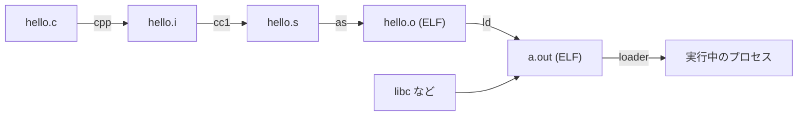

# はじめに ―― バイナリフォーマットとは何か

プログラミングを学び始めた頃、私たちは「ソースコードを書いて、コンパイルして、実行する」という流れを、ほとんど魔法のように受け入れています。`gcc hello.c` と打てば `a.out` ができ、それを実行すれば画面に文字が出る。途中で何が起きているのかを意識する必要はありませんでした。

しかし、言語処理系 ―― コンパイラ・アセンブラ・リンカ・ローダ・デバッガ ―― の内部に踏み込もうとするなら、その「途中」で受け渡されるデータの形を知らなければなりません。この章では、本書全体の地図を描きます。すなわち、**バイナリフォーマット**とは何か、なぜ [ELF](#index:ELF) と [DWARF](#index:DWARF) という 2 つのフォーマットを学ぶのか、そしてそれらがツールチェイン全体のどこに位置するのかを押さえます。

## バイナリフォーマットという考え方

[テキストファイル](#index:テキストファイル)と[バイナリファイル](#index:バイナリファイル)の違いから始めましょう。テキストファイルは、人間が読める文字（より正確には UTF-8 や ASCII といった文字符号化で表現された文字）の並びです。一方、バイナリファイルは、特定のプログラムが解釈することを前提とした、生のバイト列です。JPEG 画像、ZIP 書庫、そして実行ファイルは、すべてバイナリファイルです。

「生のバイト列」と言っても、でたらめに並んでいるわけではありません。最初の 4 バイトはマジックナンバー、次の 2 バイトはバージョン番号、その次の 8 バイトはあるテーブルへのオフセット……といったように、**どの位置に何の意味のデータが何バイト入っているか**が、あらかじめ取り決められています。この取り決めが**フォーマット**であり、フォーマットを文書として定めたものが**仕様** (specification) です。

> [!NOTE]
> フォーマットとは、要するに「バイト列の読み方の約束」です。送り手（コンパイラやリンカ）と受け手（ローダやデバッガ）が同じ約束を共有しているからこそ、別々に作られたプログラムどうしがデータをやり取りできます。約束さえ分かっていれば、バイナリは決して「読めないもの」ではありません。

フォーマットを理解する作業は、本質的には「仕様書を片手にバイト列を切り分けていく」ことに尽きます。本書では、その切り分け方を ELF と DWARF について具体的に追っていきます。

## ツールチェインの流れ

C のソースコードが実行ファイルになるまでには、いくつかの段階があります。`gcc` は内部でこれらを順に呼び出しているだけで、`-v` オプションを付けると実際の呼び出しが見えます。古典的な区分では、次の 4 段階です 。

1. **プリプロセス** (`cpp`): `#include` や `#define` を展開し、純粋な C のソース（`.i`）を作る。
2. **コンパイル** (`cc1`): C のソースをアセンブリ言語（`.s`）に翻訳する。
3. **アセンブル** (`as`): アセンブリを機械語に翻訳し、**オブジェクトファイル**（`.o`）を作る。
4. **リンク** (`ld`): 複数のオブジェクトファイルとライブラリを 1 つにまとめ、**実行ファイル**を作る。

このうち、**オブジェクトファイルと実行ファイルが ELF 形式**です。つまり ELF は、アセンブラの出力であり、リンカの入力であり、かつリンカの出力でもあり、最終的にローダ（OS の一部）の入力にもなる、ツールチェインの「共通通貨」のような存在です。

各オブジェクトファイルは、自分の中だけでは完結していません。たとえば `printf` を呼ぶコードは、`printf` の本体がどこにあるかを知りません。「`printf` という名前の関数を、後で誰かが埋めてくれ」という**未解決の参照**を残したまま出力されます。これらの参照を解決し、住所（アドレス）を確定させるのがリンカの仕事です。この「名前」と「住所」を扱う仕組みこそが、ELF を理解する上で最も重要な部分になります 。

## なぜ ELF と DWARF を分けて学ぶのか

ここで本書の構成について述べておきます。ELF と DWARF は、同じ実行ファイルの中に同居していますが、役割はまったく異なります。

- **ELF** は、**プログラムを動かすため**のフォーマットです。コード、データ、シンボル、再配置情報など、CPU と OS がプログラムを実行するのに必要な情報を運びます。これがなければプログラムは動きません。
- **DWARF** は、**プログラムを理解するため**のフォーマットです。変数名、型、ソースの行番号、スコープといった、人間がデバッグするのに必要な情報を運びます。これは無くてもプログラムは動きますが、無いとデバッガはほとんど何もできません。

両者は依存関係にあります。DWARF は単独のファイルではなく、**ELF のセクションの中に間借りして**格納されるのが普通です（`.debug_info` などのセクション名で）。したがって、DWARF を読むにはまず ELF を読めなければなりません。

この依存関係から、本書は **ELF を先に、DWARF を後に** 解説します。前半の「ELF 部」で実行ファイルの骨格を理解し、後半の「DWARF 部」でそこに乗っているデバッグ情報を読み解く、という順序です。「ELF 部・DWARF 部に分けるべきか」という問いには、**分けたうえで ELF を土台として先に置く**のが最も理解しやすい、というのが本書の答えです。

> [!TIP]
> もしあなたが「デバッガを作りたい」「クラッシュレポートのスタックトレースを自前で解釈したい」「プロファイラを書きたい」といった目標を持っているなら、ELF だけでは足りず、必ず DWARF まで必要になります。逆に「リンカやローダの仕組みを知りたい」だけなら、ELF 部だけでも大きな収穫があるでしょう。

## ELF と DWARF はどこで使われているのか

「ELF と DWARF は Windows 以外では全部これなの？」 ―― よくある疑問です。答えは「だいたいそうだが、正確には少し違う」。実行ファイルの**容れ物**とデバッグ情報の**中身**を分けて見ると、きれいに整理できます。

まず**実行ファイル形式（容れ物）**は、世の中に大きく 3 系統あります。

- **ELF** ―― Unix 系の標準。System V ABI 由来で、**Linux・各種 BSD（FreeBSD/OpenBSD/NetBSD）・Solaris/illumos・Android**、そして多くの組込み／RTOS のツールチェインが使います。Unix 系の「共通通貨」です。
- **Mach-O** ―― **Apple**（macOS・iOS・watchOS・tvOS）の形式。NeXTSTEP 由来で、ELF とは別物です。**ここが「Unix なのに ELF でない」最大の例外**です（で扱います）。
- **PE（Portable Executable）** ―― **Windows**。`.exe`・DLL のほか、UEFI ファームウェアや .NET アセンブリの容れ物でもあります（で扱います）。

つまり ELF は「Windows 以外全部」ではなく、正確には「**Unix 系の大半。ただし Apple は Mach-O**」です。

ところが**デバッグ情報（中身）**を見ると、話が変わります。**DWARF は ELF 専用ではありません**。Apple の Mach-O も、デバッグ情報は **DWARF** を使うのです（`.dSYM` バンドルに収めます）。だから DWARF は、Linux・BSD・Android に加えて **Apple まで**カバーする、Unix 世界の事実上の共通デバッグ形式になっています。これに対し、Windows だけは独自の **PDB（CodeView）** を使います。乱暴にまとめれば、「**DWARF が通じない主要 OS は、実質 Windows くらい**」というわけです。

| 系統 | 実行ファイル形式 | デバッグ情報形式 |
|---|---|---|
| Linux・各種 BSD・Solaris・Android など Unix 系 | ELF | DWARF |
| Apple（macOS・iOS …） | Mach-O | DWARF（`.dSYM` に格納） |
| Windows | PE | PDB（CodeView） |

整理すると ―― **ELF を学べば Unix 系の実行ファイルが読め、DWARF を学べば Apple まで含めてデバッグ情報が読める**。容れ物が違っても（ELF でも Mach-O でも）DWARF の読み方はそのまま通用するので、本書で身につける力の射程は、Linux 1 つにとどまりません。例外側の Windows（PE と PDB）と Apple（Mach-O）については、巻末のおまけ ―― と ―― で「ELF の言葉で」覗いてみます。

## 本書で扱う範囲と前提

ELF も DWARF も、仕様書はそれぞれ数百ページにわたる大部です。本書はそのすべてを網羅しません。代わりに、**実務やツール開発で実際によく使われる部分**に絞り、そこを具体的なバイト単位の記述まで掘り下げる方針を取ります。網羅性よりも「読んで切り分けられるようになる」ことを優先します。

前提とする環境は、次のとおり統一します。

| 項目 | 本書での前提 |
|------|------------|
| OS | Linux |
| アーキテクチャ | x86-64（AMD64） |
| ELF クラス | 64 ビット（ELFCLASS64） |
| エンディアン | リトルエンディアン |
| コンパイラ | GCC または Clang |
| デバッグ情報 | DWARF 第 5 版  |

ELF には 32 ビット版と 64 ビット版があり、構造体のフィールド幅などが異なりますが、考え方は同じです。本書では断りのない限り 64 ビット版で説明します。アーキテクチャ依存の細部、たとえば再配置の種類などは x86-64 の ABI  に従います。

> [!NOTE]
> **ABI** (Application Binary Interface) という用語がいま出てきました。ABI とは、コンパイル済みのバイナリどうしが協調動作するための取り決めの総称です。関数を呼ぶときに引数をどのレジスタに置くか、構造体をメモリにどう並べるか、そして本書のテーマである「オブジェクトファイルの形式」などを含みます。ELF は ABI の一部、あるいは ABI が前提とする土台だと考えてください。

例として用いる言語処理系のコードは、原則として読みやすい疑似コードや Ruby で示したいところですが、ELF/DWARF のように生のバイト列とポインタ演算を相手にする題材では、メモリレイアウトを率直に表現できる **C 言語**のほうが適しています。そこで本書では、ハンズオンを含め主に C を使います。読者には C の基本的な文法（構造体、ポインタ、`fread` などのファイル入出力）を前提とします。

次章からいよいよ ELF 部に入ります。まずは ELF ファイル全体を上空から眺め、「2 つの見え方」という ELF 最大の特徴をつかむところから始めましょう。
